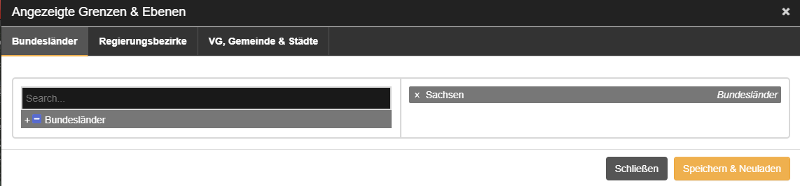
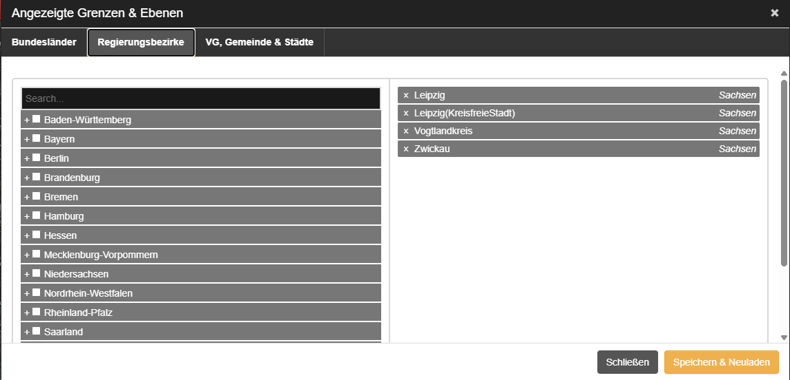
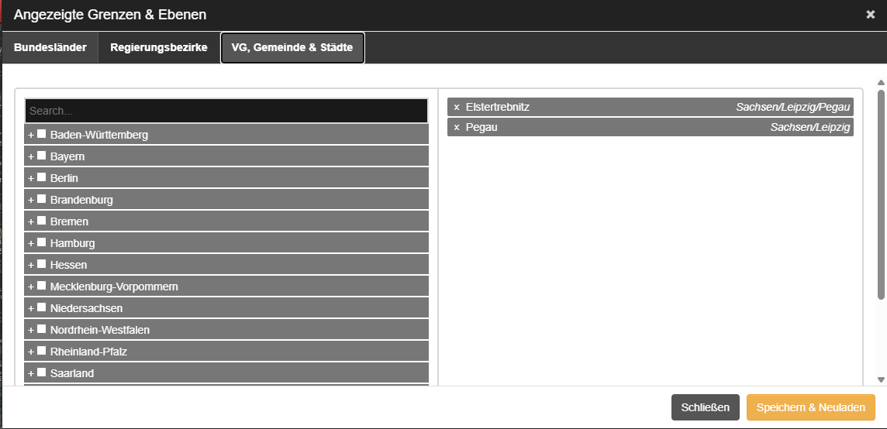
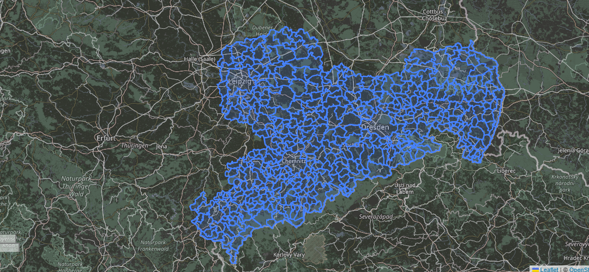
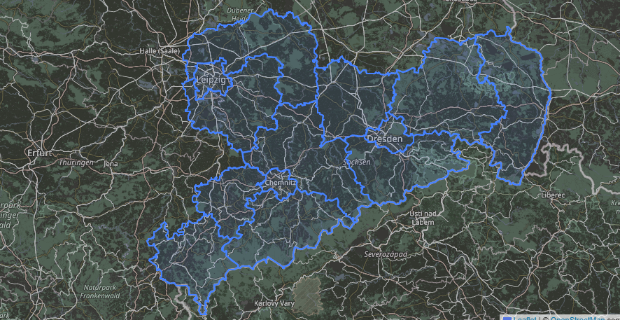
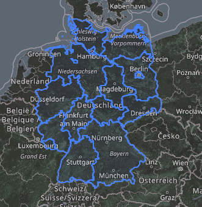

# 🗺️ LSS Karte

Dieses Skript basiert auf dem großartigen Projekt: [DispoPlus von jxn-30](https://github.com/jxn-30/DispoPlus).

**Aktuelle Version:** `3.0.0`

---

## 📸 Screenshots

### 🖥️ Interface-Optionen
Hier siehst du die verschiedenen Ebenen, die du im Interface auswählen kannst:

| Bundesländer | Landkreise | Städte & Gemeinden |
| :---: | :---: | :---: |
|  |  |  |

### 🗺️ Beispiele in der Praxis
So sieht die Karte aus, wenn die verschiedenen Filter und Grenzen aktiv sind:

| Detailansicht Sachsen | Bundesland-Fokus | Deutschland-Übersicht |
| :---: | :---: | :---: |
|   *Sachsen komplett (Landkreise & Städte)* |   *Sachsen mit Landkreisen* |   *Deutschland-Gesamtansicht* |

*(Hinweis: Für die reine Bundesland-Ansicht von Sachsen gibt es auch die Datei `images/sachsen.png`)*

---

## ✨ Features
* **Drei Zoom-Ebenen:** Nahtloser Wechsel zwischen Bundesländern, Landkreisen und einzelnen Städten/Gemeinden.
* **Perfekt für LSS:** Optimiert für die Leitstellenspiel-Logistik, um Wachen und Einsätze besser zu koordinieren.
* **Klares Design:** Grenzen werden sauber und performant auf der Karte gezeichnet.

## 🛠️ Installation & Nutzung
1. Stelle sicher, dass du einen Userscript-Manager (wie Tampermonkey) installiert hast.
2. Installiere das Skript.
3. Lade die Karte im Spiel neu und nutze das neue Interface am rechten Bildschirmrand.